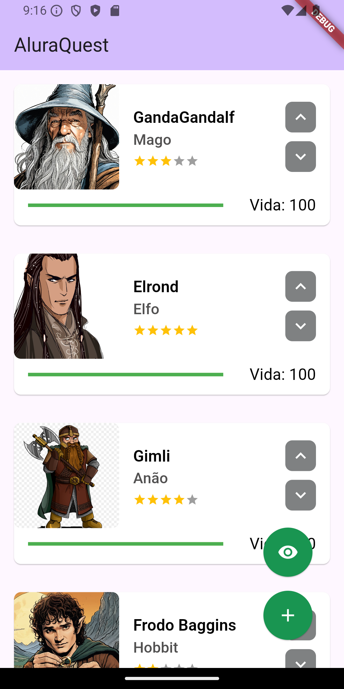
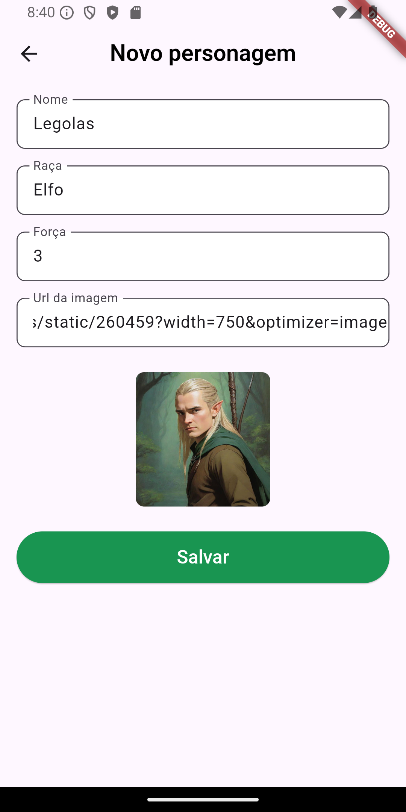
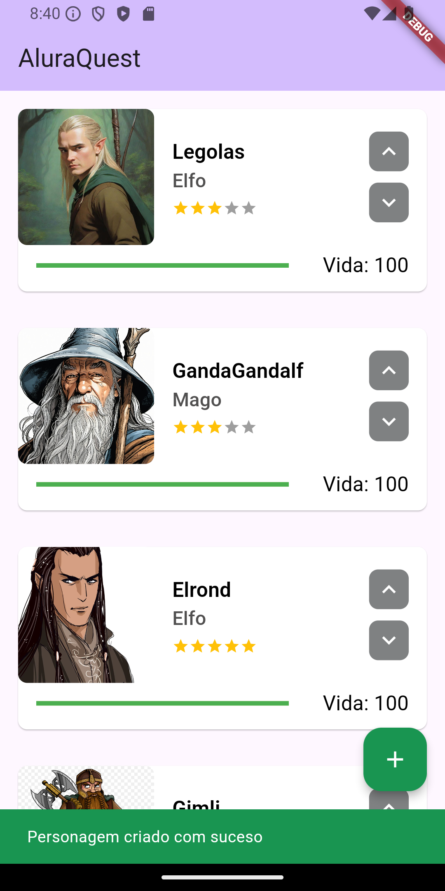

## 💻 Projeto

- Está aplicação tem como objetivo de reforçar os conceitos basicos de flutter.
<br>

## ⓘ Informações

O AluraQuest é um sistema gamificado de aprendizado, inspirado em aventuras de RPG, cujo objetivo é levar estudantes a uma jornada de domínio da linguagem de programação Dart. Os alunos realizam missões, acumulam habilidades e avançam em desafios para se tornarem mestres em Dart. O foco é transformar o aprendizado técnico em uma experiência interativa e envolvente.

  <br><br>


## ✅ Funcionalidades existentes

- Visualizar lista de personagens;
- Aumentar e dimunuir pontos de vida do personagm;
- Botão de fazer a lista aparecer e desaparecer;
- Criar novo personagem.

<br>

## ✅ Resultado do projeto

<h1 align="center">
  
  
  
</h1>

<br>

## 🎲 Executar
### Ambiente
- Certifique-se de que tenha o flutter configurado em sua mpáquina;
- A versão utilizada nesse projeto é a 3.22.2

### Projeto
1. Clone o repositório e entre na pasta:

   ```bash
   git clone https://github.com/WillianMedeiros14/characters.git
   cd comex_app
   ```

2. Baixe as dependências:

   ```bash
   flutter pub get
   ```

4. Execute a aplicação:
- Depois de ter realizado os passos anteriores, pode rodar normalmente o aplicativo. 

<br>

## 🚀 Principais recursos e tecnologias ultilizadas
- **[Flutter](https://flutter.dev/)**.
- **[MobX](https://mobx.netlify.app/)**.
- **[Provider](https://pub.dev/packages/provider)**.
