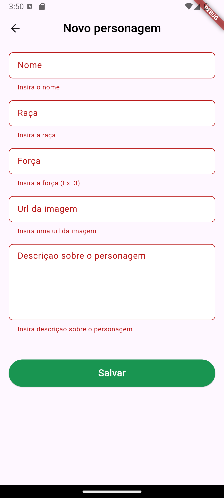
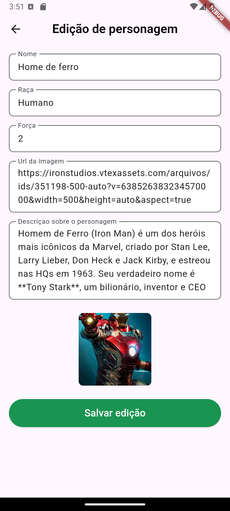
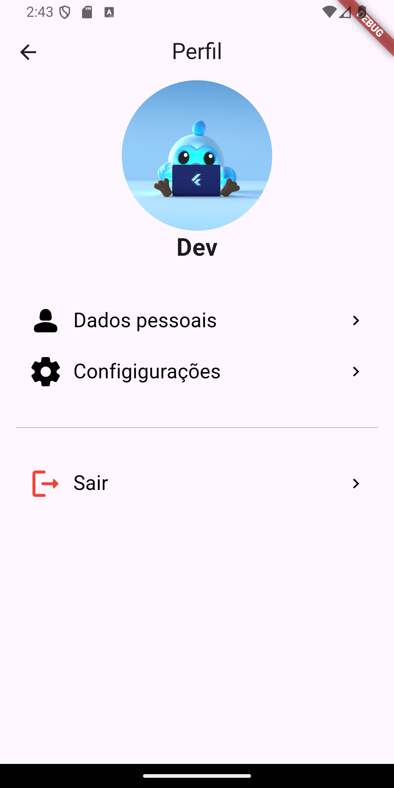

## 💻 Projeto

- Está aplicação tem como objetivo de reforçar os conceitos basicos de flutter.
  <br>

## ⓘ Informações

O AluraQuest é um sistema gamificado de aprendizado, inspirado em aventuras de RPG, cujo objetivo é levar estudantes a uma jornada de domínio da linguagem de programação Dart. Os alunos realizam missões, acumulam habilidades e avançam em desafios para se tornarem mestres em Dart. O foco é transformar o aprendizado técnico em uma experiência interativa e envolvente.


## ✅ Funcionalidades existentes

- Login;
- Criar conta;
- Alterar a visualização entre Lista e Slider;
- Visualizar lista de personagens;
- Visualizar Slider de personagens;
- Aumentar e dimunuir pontos de vida do personagm;
- Botão de fazer os personages aparecer e desaparecer;
- Visualizar detalhes do personagem;
- Criar novo personagem;
- Pesquisar;
- Editar personagem;
- Deletar personagem;
- Perfil;
- Sair.

<br>

## ✅ Resultado do projeto

<h1 align="center">
  
  
  
  
  
  
  
  
  
</h1>

<br>

## 🎲 Executar

### Ambiente

- Certifique-se de que tenha o flutter configurado em sua máquina;
- A versão utilizada nesse projeto é a 3.22.2

### Api

- Para o projeto funcionar, é necessário que a api characters_API na branch main esteja executando. Acesse o link abaixo para saber como executar: <br>
  **[characters_API](https://github.com/WillianMedeiros14/characters_API.git)**

### Projeto

1. Clone o repositório e entre na pasta:

   ```bash
   git clone https://github.com/WillianMedeiros14/characters.git
   cd characters
   ```

2. Acesse a branch main:

   ```bash
    git checkout main
   ```

3. Baixe as dependências:

   ```bash
   flutter pub get
   ```

4. Altere o ip da baseUrl:

- Como a api vai estar sendo executada localmente, você precisa alterar o ip na baseUrl.

  ```bash
  # depois de pegar o ip da sua máquina na rede, altere no arquivo abaixo.
  # o arquivo fica em 'characters\lib\shared\data\dio\dio_client_http.dart'
  # A linha que precisa alterar é essa: dio.options.baseUrl = 'http://192.168.110.145:8080/';

  dio.options.baseUrl = 'http://seu_ip_vai_aqui:8080/';
  ```

5. Execute a aplicação:

- Depois de ter realizado os passos anteriores, pode rodar normalmente o aplicativo.

<br>

## 🚀 Principais recursos e tecnologias ultilizadas

- **[Flutter](https://flutter.dev/)**.
- **[MobX](https://mobx.netlify.app/)**.
- **[Provider](https://pub.dev/packages/provider)**.
- **[Sqflite](https://pub.dev/packages/sqflite)**.
- **[Dio](https://pub.dev/packages/dio)**.
